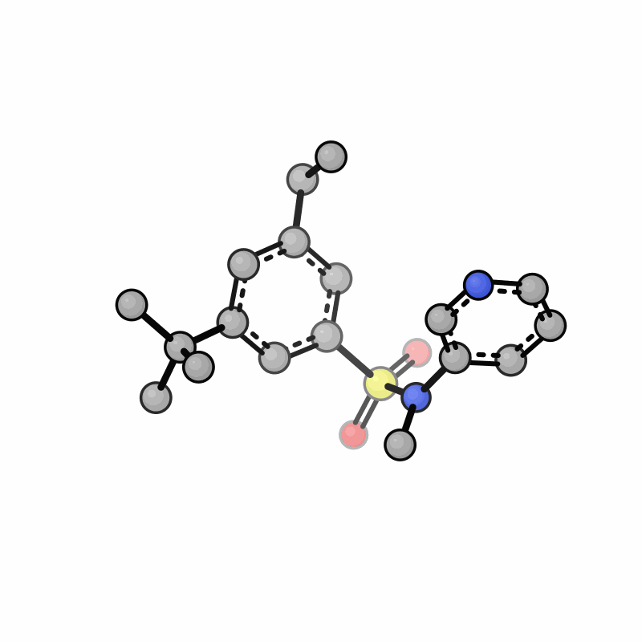
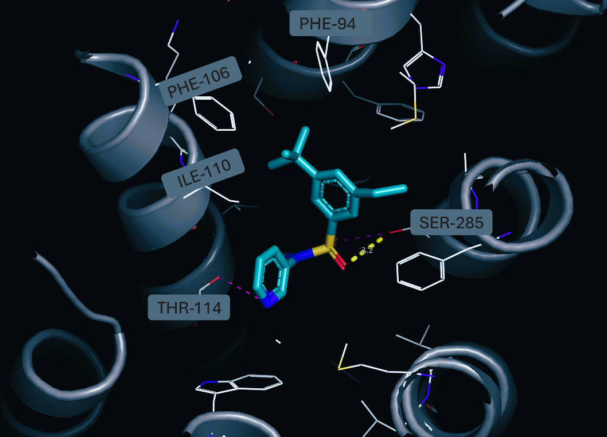
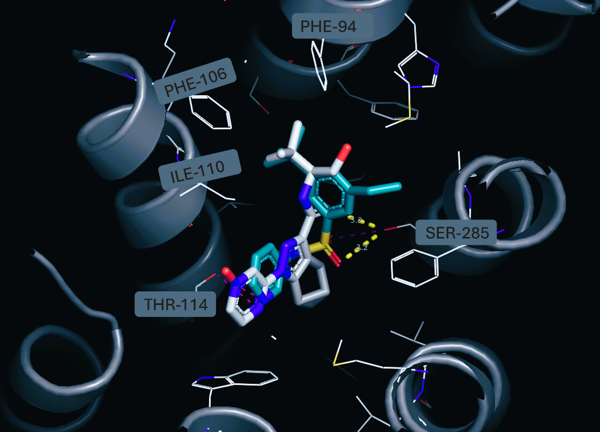
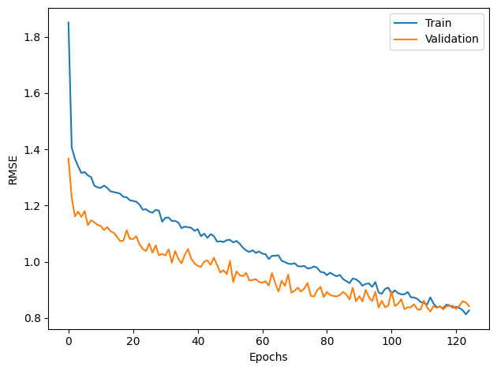
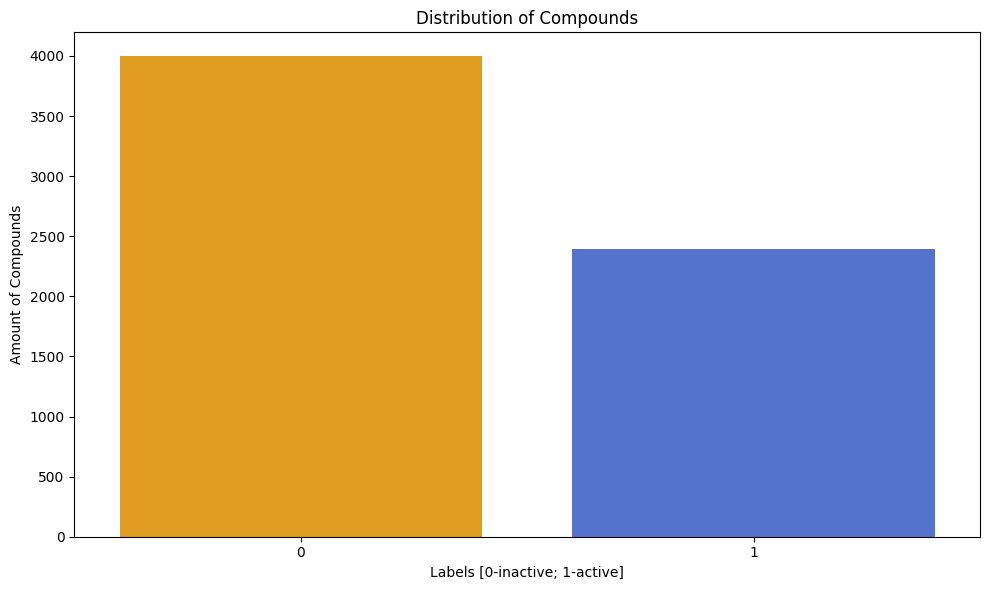
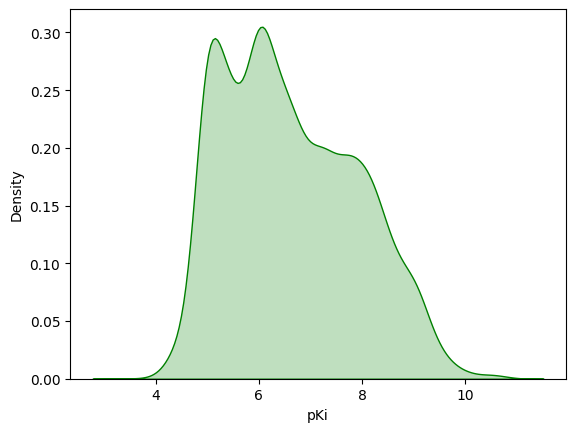
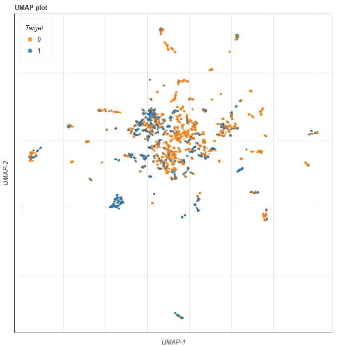

# ⚗️ CADD Toolkit for CB2 Agonists

<br> <p align="center">  </p> <p align="center"><em>**Fig.1.** Hit molecule. Animation rendered using the **xyzrender** (https://github.com/aligfellow/xyzrender)</em></p>

This repository provides a collection of tools for **Computer-Aided Drug Design (CADD)** focused on **CB2 receptor agonists** as well as basic docking analysis of certain compound, which was created via following workflow. The project integrates **large language models (LLMs)** for molecule generation with a **GNN-based QSAR model** for affinity prediction, along with auxiliary utilities for chemical structure processing.

---

## 🧪 Hit

The proposed workflow enabled the identification of pyridine-3-sulfonamide derivative (CCc1cc(C(C)(C)C)cc(S(=O)(=O)N(C)c2cccnc2)c1) as a promising starting point for further optimization. The binding affinity of the compound was initially estimated using a GNN-based QSAR model, yielding a predicted value of pKi = 7.106048. This result was subsequently refined using the **Boltz-2** model, corresponding to an estimated binding affinity of approximately 150 nM.

To ensure the robustness and reliability of the screening protocol, ensemble molecular docking was performed against four crystallographic structures of the CB2 receptor available in the Protein Data Bank (PDB): 8GUT, 8GUS, 8GUR, and 8GUQ. Docking simulations were conducted using **AutoDock Vina**, implemented via the **DockingPie** plugin for **PyMOL** (https://github.com/paiardin/DockingPie
). Molecular visualization and analysis were carried out in PyMOL (https://github.com/schrodinger/pymol-open-source) with the use of **show_contacts script** (https://github.com/dkoes/show_contacts).

Representative docking results for the 8GUQ structure are presented below. The proposed compound preserves all key interactions within the CB2 receptor binding pocket. Furthermore, a high degree of alignment between the pharmacophoric features of the designed molecule and the co-crystallized ligand, **olorinab**, can be observed.

<p align="center">
  
</p>
<p align="center">
  <em><strong>Fig. 2.</strong> Proposed compound in the active site of the 8GUQ crystal structure following molecular docking.</em>
</p>


<p align="center">
  
</p>
<p align="center">
  <em><strong>Fig. 3.</strong> Superposition of the proposed compound (blue) and the co-crystallized ligand, olorinab (white), in the active site of the 8GUQ crystal structure.</em>
</p>

<br>

It should be noted that, although this compound demonstrates favorable properties, it does not represent the most promising candidate generated and evaluated using the present toolkit.

---

## 📦 Repository Contents

### 🔹 `GNN_notebook.7z`

> Compressed notebook (.ipynb) file with basic EDA of ligand library curated from ChEMBL and GNN training, optimization and evaluation.  
> The model was trained using an NVIDIA L4 GPU via Google Colab.

**Model Performance (RMSE):**

| Dataset           | RMSE      |
|-------------------|-----------|
| Train (0,7)       | 0.8264    |
| Validation (0,15) | 0.8416    |
| Test (0,15)       | 0.8390    |

<p align="center">
  
</p>
<p align="center">
  <em><strong>Fig.4.</strong> Training and validation RMSE progression over epochs.</em>
</p>

---

### 🔹 `df_cb2.xls`

> Ligand library curated from the ChEMBL database.

**Data Visualizations:**

<p align="center">
  
</p>
<p align="center">
  <em><strong>Fig.5.</strong> Bar plot showing the number of records in each binary class.</em>
</p>

<p align="center">
  
</p>
<p align="center">
  <em><strong>Fig.6.</strong> KDE plot displaying the distribution of pKi values across the ligand library.</em>
</p>

<p align="center">
  
</p>
<p align="center">
  <em><strong>Fig.7.</strong> UMAP projection of ligand scaffolds using <strong>ChemPlot</strong>, visualizing the chemical space.</em>
</p>

---

### 🔹 `gnn_venv.yml`

> Conda environment configuration file used for gen-gnnVS.ipynb and affinity_predictor.py.
---

### 🔹 `ChemBERT_module2.py`

> Module implementing the **first LLM**, based on the ChemBERTa architecture, used for working with SMILES representations.  
> **Source model:** ChemBERTaLM  
> https://huggingface.co/gokceuludogan/ChemBERTaLM  

---

### 🔹 `affinity_predictor.py`

> A **CLI script** for predicting binding affinity (`pKi`) toward CB2 using a trained QSAR model.  
>  
> **Features:**  
> - prediction for **single SMILES strings**  
> - batch prediction for **`.csv` files** (provided as a string path argument)
> - requires the trained model file (`.pth`) to be located in the same directory as the script.
**Example Usage (Single SMILES):**

```bash
python affinity_predictor.py "CCc1cc(C(C)(C)C)cc(S(=O)(=O)N(C)c2cccnc2)c1"
```

```bash
python affinity_predictor.py "filepath\file.csv"
```
---

### 🔹 `attentivefp_cb2_model.pth`

> A trained **QSAR model**:  
> - **GNN-based architecture** (AttentiveFP)  
> - trained on the full dataset  
> - used to predict **pKi** values for CB2 agonists  

---

### 🔹 `gen-gnnVS.ipynb`

> A research notebook integrating the full CADD workflow:  
> - molecule generation using **LLMs**  
> - **pKi** prediction using the GNN model  
> - calculation of molecular descriptors  
> - selection of candidates for downstream analysis (virtual screening)  
>  
> The notebook serves as a **generative + predictive CADD pipeline**.  

---

### 🔹 `openbabel_converter.py`

> A **CLI utility** based on OpenBabel:  
> - converts **SMILES → `.pdb` files**  
> - input: a `.csv` file containing SMILES (passed as a path argument)  

---

### 🔹 `drugGen_generator.py`

> Script originating from https://huggingface.co/alimotahharynia/DrugGen,  
> implementing the **second LLM**, which generates molecules based on **biological (protein) sequences**.  
>  
> **Source model:** DrugGen  
> https://huggingface.co/alimotahharynia/DrugGen

---

## 🧠 Summary
The project combines:
- **LLM-based molecular generation** (ChemBERTaLM, DrugGen)
- **GNN-based QSAR modeling** for affinity (`pKi`) prediction
- **CLI tools** for prediction and structure conversion

Altogether, it forms a complete **generative + predictive CADD pipeline** for **CB2 agonists**.

---

## 📚 References

If you use this repository or its components, please cite the original works associated with the underlying models:

Sheikholeslami, M., Mazrouei, N., Gheisari, Y., Fasihi, A., Irajpour, M., & Motahharynia, A.* (2025).  
DrugGen enhances drug discovery with large language models and reinforcement learning.  
*Scientific Reports*, 15, 13445. https://doi.org/10.1038/s41598-025-98629-1

```bibtex
@article{Sheikholeslami2025DrugGen,
  title   = {DrugGen enhances drug discovery with large language models and reinforcement learning},
  author  = {Sheikholeslami, M. and Mazrouei, N. and Gheisari, Y. and Fasihi, A. and Irajpour, M. and Motahharynia, A.},
  journal = {Scientific Reports},
  volume  = {15},
  pages   = {13445},
  year    = {2025},
  doi     = {10.1038/s41598-025-98629-1}
}
```

Uludoğan, G., Ozkirimli, E., Ulgen, K. O., Karalı, N. L., & Özgür, A. (2022).  
Exploiting Pretrained Biochemical Language Models for Targeted Drug Design.  
*Bioinformatics*. https://doi.org/10.1093/bioinformatics/btac482

```bibtex
@article{10.1093/bioinformatics/btac482,
    author = {Uludoğan, Gökçe and Ozkirimli, Elif and Ulgen, Kutlu O. and Karalı, Nilgün Lütfiye and Özgür, Arzucan},
    title = "{Exploiting Pretrained Biochemical Language Models for Targeted Drug Design}",
    journal = {Bioinformatics},
    year = {2022},
    doi = {10.1093/bioinformatics/btac482},
    url = {https://doi.org/10.1093/bioinformatics/btac482}
}

```

---

## 🧾 Citation of this repository

If you use **presented compound, tools, pipelines or models provided in this repository** (e.g. for CB2 agonist discovery or related molecular design tasks), please cite the repository author as:

> **Adam Mazur** — *CADD tools for CB2 agonist discovery* (GitHub repository)

This is an **informal citation** intended for acknowledgements, software citations, or methods sections when the repository is used as a research tool.

---


## ⚠️ Disclaimer
- The repository integrates pretrained models from the literature; proper citation of the original works is required when used in academic contexts.
- The code is intended for **research and proof-of-concept** purposes.

---

